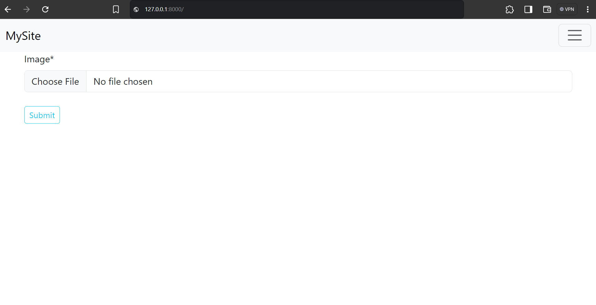
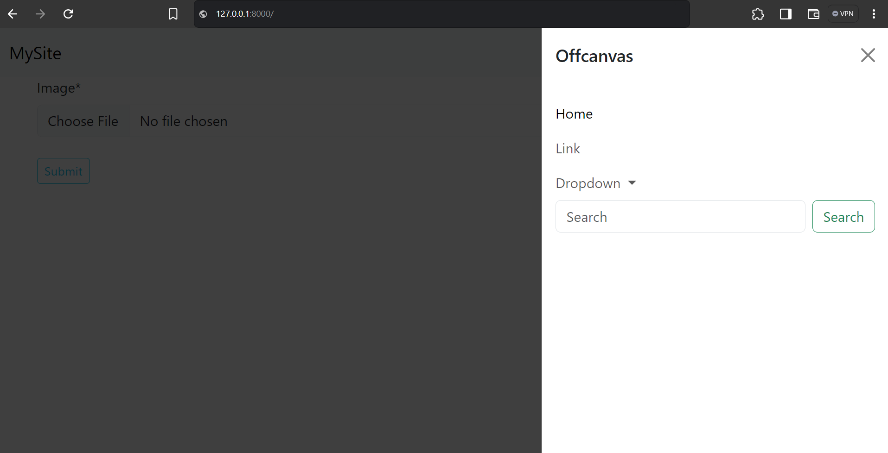

# Django_Boilerplate_Beginners

A Simple beginner Django Web Application Boiler Plate

## Home page



- With Bootstrap offcanvas navbar




## What's included

1. app folder 
    - to keep all the apps at one place. With a sample app `artists`.

2. requirements folder
    Separate for base, development, production & testing

3. secrets.json
    - to store database, email backend credentials and the secret-key

4. Asset/static
    - Local static files with, bootstrap

5. django-crispy-forms

6. Bootstrap-css configuration in `base.html`


## Requirements
```bash
asgiref==3.8.1
Django==5.0.7
django-crispy-forms==2.3
crispy-bootstrap5==2024.2
Pillow==10.4.0
sqlparse==0.5.1
tzdata==2024.1
```
