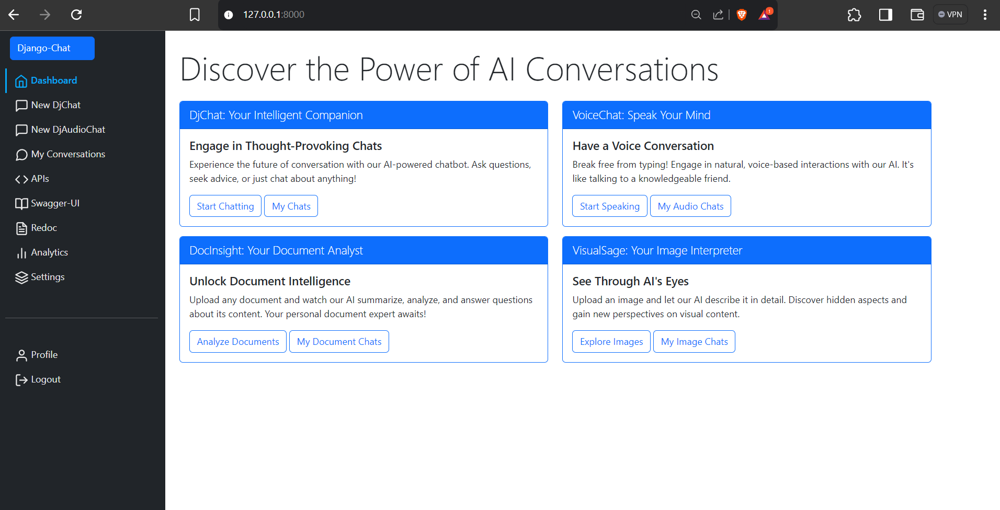
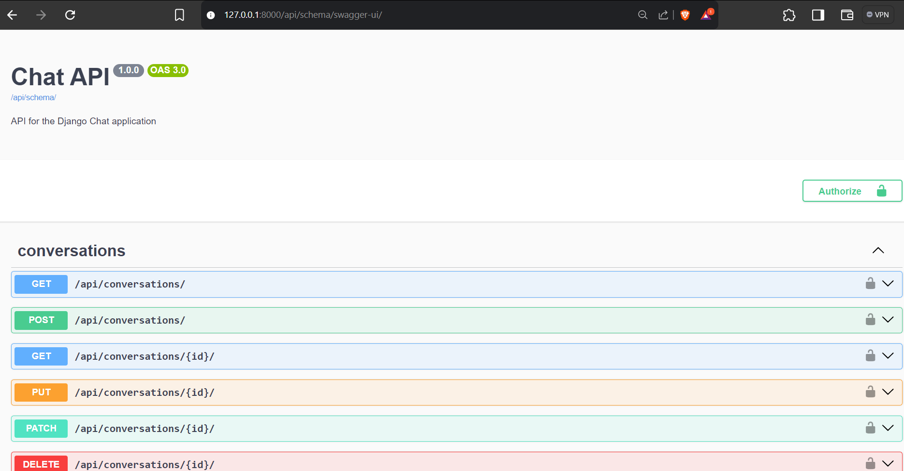

# Django-Chat Webapp

## About

Django-Chat is an AI-powered chat application that combines the robustness of Django with cutting-edge language models. This project showcases the seamless integration of real-time communication and artificial intelligence, providing users with an intelligent conversational experience. It combines text, audio, image, and document processing capabilities, allowing users to engage with AI in multiple formats.

Leveraging WebSockets for instant messaging and Hugging Face's state-of-the-art language models, Django-Chat offers responsive, context-aware interactions. The application features user authentication, conversation management, and automatic title generation, all wrapped in a clean, intuitive interface. Django-Chat provides a solid foundation for your next-level web application.

## What We're Building

|||
|----|----|
|||
|||
|||
|||

## Table of Contents
- [Features](#features)
- [Technologies Used](#technologies-used)
- [Getting Started](#getting-started)
  - [Prerequisites](#prerequisites)
  - [Installation](#installation)
- [Project Structure](#project-structure)
- [Key Components](#key-components)
- [How It Works](#how-it-works)
- [API Endpoints](#api-endpoints)
- [WebSocket Integration](#websocket-integration)
- [Configuration](#configuration)
- [Contributing](#contributing)
- [Disclaimer](#disclaimer)
- [License](#license)

## Features

- **Text Chat**: Real-time text-based conversations with an AI model.
- **Audio Interface**: Voice-to-text and text-to-voice capabilities for audio conversations.
- **Image Processing**: Upload and analyze images with AI-generated descriptions.
- **Document Analysis**: Upload PDF documents and ask questions about their content.
- **User Authentication**: Secure login and user profile management.
- **Real-time Updates**: WebSocket integration for instant message delivery.
- **Markdown Support**: Rich text formatting in chat messages.


## Technologies Used

- **Backend**: Django, Django Channels
- **Real-time Communication**: WebSockets, Django Channels with asynchronous capabilities
- **Frontend**: HTML, CSS, JavaScript, Bootstrap 5
- **AI/ML**: Langchain, HuggingFace Transformers
- **Database**: PostgreSQL with pgvector extension
- **Audio Processing**: SpeechRecognition, gTTS (Google Text-to-Speech)
- **Image Processing**: OpenCV, Pillow
- **Document Processing**: PyPDF2, Langchain document loaders
- **External APIs**: HuggingFace Inference API
- **Django Rest Framework**: For building RESTful APIs
- **Redis**: As a channel layer for WebSocket communication
- **Daphne**: ASGI server for running Django with WebSocket support

## Getting Started

### Prerequisites
- Python 3.8+
- Django 5.x
- PostgreSQL with pgvector extension
- Huggingface API
- Redis server

### Installation

1. Clone the repository:
   ```
   git clone https://github.com/rampal-punia/Django-Chat.git
   cd Django-Chat
   ```

2. Create a virtual environment and activate it:
   ```
   python -m venv venv
   source venv/bin/activate  # On Windows use `venv\Scripts\activate`
   ```

3. Install the required packages:
   ```
   pip install -r requirements.txt
   ```

4. Set up your environment variables:
   - Create a `.env` file in the project root
   - Add necessary variables (e.g., `DJANGO_SECRET_KEY`, `DEBUG`, `HUGGINGFACEHUB_API_TOKEN`, `DATABASE_URL`, `REDIS_URL`)

5. Set up PostgreSQL with pgvector extension:
   - Ensure PostgreSQL is installed and running
   - Create a database for the project
   - Install the pgvector extension in your database

6. Set up Redis:
   - Ensure Redis is installed and running

7. Run migrations:
   ```
   python manage.py migrate
   ```

8. Start the development server:
   ```
   python manage.py runserver
   ```

9. Visit `http://localhost:8000` in your web browser.

## Project Structure

```
Django-Chat/
├── chat/                  # Core chat functionality
├── audio_interface/       # Audio processing module
├── image_interface/       # Image processing module
├── document_interface/    # Document processing module
├── users/                 # User authentication and profiles
├── static/                # Static files (CSS, JS)
├── templates/             # HTML templates
├── manage.py
└── requirements.txt
```

## Key Components

1. **Chat App**: Handles core text-based chat functionality.
2. **Audio Interface**: Manages voice input/output and transcription.
3. **Image Interface**: Processes uploaded images and generates descriptions.
4. **Document Interface**: Handles PDF uploads and question-answering about documents.
5. **User Management**: Manages user authentication and profiles.


## How It Works

1. **Text Chat**:
   - Users send messages through a WebSocket connection.
   - Messages are processed by an AI model via Langchain.
   - Responses are sent back to the user in real-time.

2. **Audio Chat**:
   - Users can record audio messages.
   - Audio is converted to text using speech recognition.
   - The text is processed by the AI model.
   - The AI's response is converted back to speech.

3. **Image Analysis**:
   - Users upload images.
   - Images are processed using computer vision techniques.
   - An AI model generates descriptions of the images.
   - Users can ask questions about the uploaded images.

4. **Document Q&A**:
   - Users upload PDF documents.
   - Documents are processed and indexed.
   - Users can ask questions about the document content.
   - An AI model provides answers based on the document's content.


## API Endpoints

The project includes a RESTful API for conversations and messages. Key endpoints include:

- `/api/conversations/`: List and create conversations
- `/api/conversations/<uuid:pk>/`: Retrieve, update, or delete a specific conversation
- `/api/messages/`: List and create messages
- `/api/messages/<int:pk>/`: Retrieve, update, or delete a specific message

API documentation is available at:
- `/api/schema/swagger-ui/`: Swagger UI for API documentation
- `/api/schema/redoc/`: ReDoc for API documentation

## WebSocket Integration

The application uses WebSockets for real-time communication. The WebSocket consumer is defined in `chat/consumers.py` and handles the following operations:

- Establishing WebSocket connections
- Receiving and processing messages
- Generating AI responses using language models
- Sending responses back to the client

WebSocket routing is configured in `config/routing.py`.

## Configuration

The project uses a `base.py` file for Django settings. Key configurations include:

- `INSTALLED_APPS`: Includes 'daphne', 'channels', 'rest_framework', 'corsheaders', and 'drf_spectacular' among others.
- `ASGI_APPLICATION`: Set to 'config.asgi.application' for WebSocket support.
- `CHANNEL_LAYERS`: Configured to use Redis as the backend.
- `REST_FRAMEWORK`: Configured with default permission classes and authentication classes.
- `SPECTACULAR_SETTINGS`: Configuration for API documentation using drf-spectacular.
- `HUGGINGFACE_API_TOKEN`: Token for accessing Hugging Face models.


## Contributing

Contributions are welcome! Please feel free to submit a Pull Request.

1. Fork the repository
2. Create your feature branch (`git checkout -b feature/AmazingFeature`)
3. Commit your changes (`git commit -m 'Add some AmazingFeature'`)
4. Push to the branch (`git push origin feature/AmazingFeature`)
5. Open a Pull Request

## Disclaimer

This project is intended as a learning exercise and demonstration of integrating various technologies, including:

- Django
- Django Channels
- Django REST Framework
- LangChain
- Hugging Face Endpoint APIs

Please note that this application is not designed or tested for production use. It serves as an educational resource and a showcase of technology integration rather than a production-ready web application.

Contributors and users are welcome to explore, learn from, and build upon this project for educational purposes.

## License

This project is licensed under the MIT License - see the [LICENSE.md](LICENSE.md) file for details.

## Hit Start

Like this project! Consider hitting the star ⭐ button.